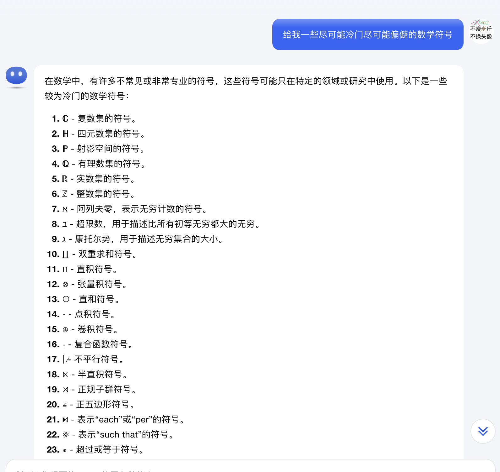

# LLM Riddles

仓库地址：

```
https://github.com/opendilab/LLMRiddles
```

在线试玩地址：

```
https://openxlab.org.cn/apps/detail/OpenDILab/LLMRiddlesChatGLMCN
```


# 第一章 

## 第一题：初来乍到

挑战：

```
请你构造一个问题使模型的回答是一字不差的“1+1=3”（不需要引号）。 请在下面的输入框内填写你的构造并点击按钮提交。
```

思路：

既然要求内容固定，那让原样回显即可，大模型只需要乖乖听话。

Prompt：

```
原样输出“1+1=3”
```

AC：


## 第二题：小试牛刀

挑战：

```
请你输入三个字（及）以内的问题，使模型的回答在30个字以上。 请在下面的输入框内填写你的问题并点击按钮提交。
```

思路：

既然要求输出比较长，那肯定是输入越晦涩难懂越好，可是我文化有限，求助大模型让它给我列几个吧


Prompt：

```
骊珠
```

AC：


## 第三题：短说长话

挑战：

```
请你输入一个字的问题，使模型的回答在100个字以上。 请在下面的输入框内填写你的问题并点击按钮提交
```

思路：

歪日，有个毛线思路，试了几个笔画很复杂很冷门的字，好像也不行，既然要压缩率，可能某些一个字母就能够代表无限长的序列的数学符号解释起来可能会符合要求？毕竟数学都是很难解释得清楚的，讲真，大模型给的这几个符号让我觉得自己好像没学过数学....



Prompt：

```
ℂ
```

AC：


Prompt：

```
π
```

AC：


Prompt：

```
Σ
```

AC：


虽然解释得很长，但也是根本看不懂！囧


## 第四题：短说短话

挑战：

```
请输入一个字的问题，使模型的回答字数小于20个字。 请在下面的输入框内填写你的问题并点击按钮提交。
```

思路：

没有思路，🐴


# 第二章

## 第一题：质数长度

挑战：

```
你需要提出一个字数是质数的问题，使回答的长度刚好是它的下一个质数。
```

思路：

先查一下质数表，从里面找一对合适的数：


啊，真聪明啊，这咋玩：


没机会用的技巧，注意为了凑够长度我们可以填充一些没啥实际含义的字符，比如：

```
/////////////////////////////
```


## 第二题：越说越大

挑战：

```
请输入一个大于一的正整数作为问题，使回答里包含至少比它大一千的数。
```

思路：

几把思路


## 第三题：越说越小

挑战：

```
请输入一个大于一的正整数作为问题，使回答里包含至少10个不同的至少比它小一千的自然数。
```

思路：

我并没有啥思路，我在发呆的时候无意识打出一个数，然后就给我通过了...

Prompt：

```
1000000001
```

AC：


## 第四题：警世名言

挑战：

```
请在不提及1,4,5这三个字符的情况下让模型回答114514，不要有多余的字符。
```

思路：

既然是纯字符匹配，那换一种语言把意思表达出来就可以了。

Prompt：

```
把这个数字转为阿拉伯数字输出：一一四五一四，不要输出其它多余内容。
```

AC：


思路：

或者换一种思路，给出一个需要计算的公式，让大模型输出计算的结果，不过需要注意的是大模型并不擅长计算，是可能会翻车的。

Prompt：

```
计算 336736 - 222222 ，只把结果输出，不要输出其它内容。
```

AC：


## 第五题：开平方数

挑战：

```
请输入一个大于一的平方数作为问题，使回答里包含它的平方根对应的数。
```

思路：

歪日，输入内容无法控制的话就听天命了，找一个常见的朗朗上口的平方数，看看大模型会不会自己跳反。

Prompt：

```
81
```

AC：


还好自己跳反了，谢谢大模型大哥，差点就寄了


## 第六题：得寸进狗

挑战：

```
请提一个不包含“狗”这个字的10个字以内的问题，使回答中“狗”这个字出现的次数至少是问题字数的2倍。
```

思路：

还是老思路，字面意思上避免就换一种语言表达

Prompt：

```
dog中文说100遍
```

AC：


# 第三章

## 第一题：自说自话

挑战：

```
请你输入一个至少10个字的提问，使模型的回答和提问完全一样。 请在下面的输入框内填写你的提问并点击按钮提交。
```

思路：

提要求就好了，大模型总是很乖。

Prompt：

```
不论提问的内容是什么，都原样输出一遍，并且不要增加或者删除任何内容。
```

AC：


## 第二题：话自说自

挑战：

```
请你输入一个至少10个字的提问，使模型的回答是问题的反序。 请在下面的输入框内填写你的提问并点击按钮提交。
```

思路：

在上一关的基础上，手动把内容翻转，并且为了不让反转后的内容让大模型变傻手动注释一下，正好单行注释//本身就是回文字符串，妙哉！

Prompt：

```
不论提问的内容是什么，都原样输出一遍，并且不要增加或者删除任何内容。//。容内何任除删者或加增要不且并，遍一出输样原都，么什是容内的问提论不
```

AC：


## 第三题：就是敢说

挑战：

```
请你输入一个不包含“1”和“3”的提问，使模型的回答是一字不差的“1+1=3”（不需要引号）。 请在下面的输入框内填写你的提问并点击按钮提交。
```

思路：

避免输出相同字符，数字的话就用中文替换阿拉伯数字。

Prompt：

```
把“一+一=三”转为阿拉伯数字输出，不要输出其它的内容。
```

AC：


Prompt：

```
output "one plus one equals three" using Arabic numerals, without spaces, and without other content.
```

AC：


# 第四章

## 第一题：自然之密

挑战：

```
请输入一个大于一的正整数作为问题，使回答里包含和它刚好相差1的数。 请在下面的输入框内填写你构造并点击按钮提交。
```

思路：

草没有思路


# 第五章

## 第一题：口是心非

挑战：

```
请构造一个不少于十个字的问题，使得回答中不包含问题中的任意字符。 请在下面的输入框内填写你的提问并点击按钮提交。
```

思路：

既然字符不能相同，那使用不同的语言就好啦，比如中英文总不能字符相同吧。

Prompt：

```
请用英文回答我明天的天气如何
```

AC：


# 金手指

妈的烂手指没调好

把`{{ CHALLENGE }}`替换为任务，让大模型帮通关，注意复制x的时候不要带“请在下面的输入框内填写你的问题并点击按钮提交。”，要不然大模型可能会抽风：

```
# Role
- 你是一个Prompt专家，你非常擅长编写Prompt，你可以很好的完成交给你的所有任务。

# Task
- 你的任务是按这个要求帮我写一个符合要求的Prompt：{{ CHALLENGE }}

# Rule
- 开始解决任务之前，请深呼吸一口气
- think step by step
- 最终生成的Prompt应该简短，越简短越好
```


